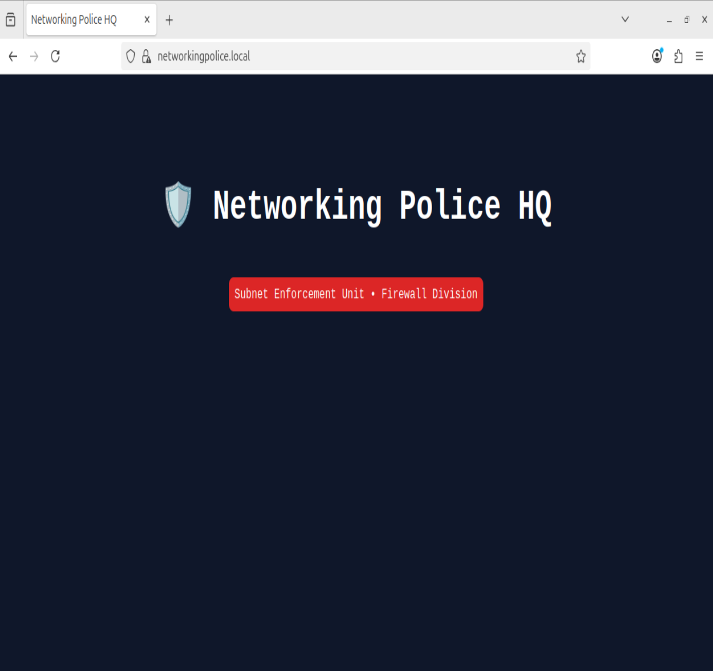
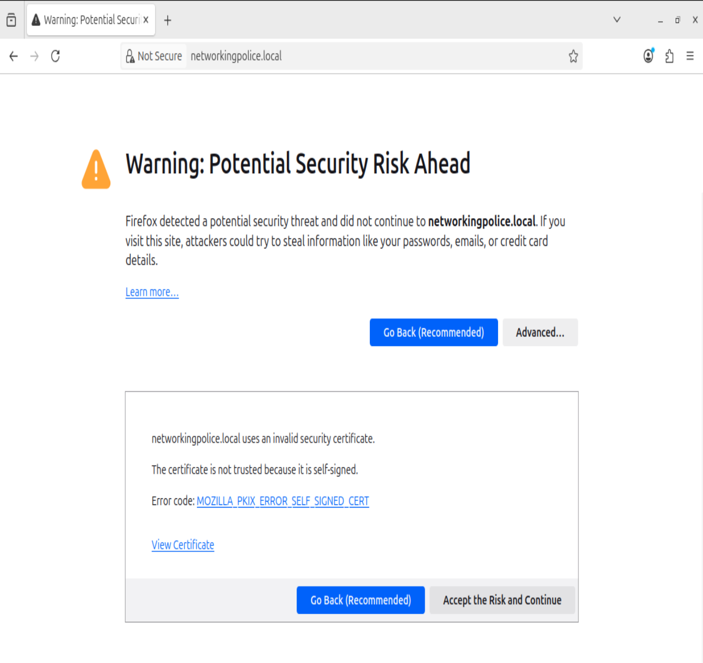
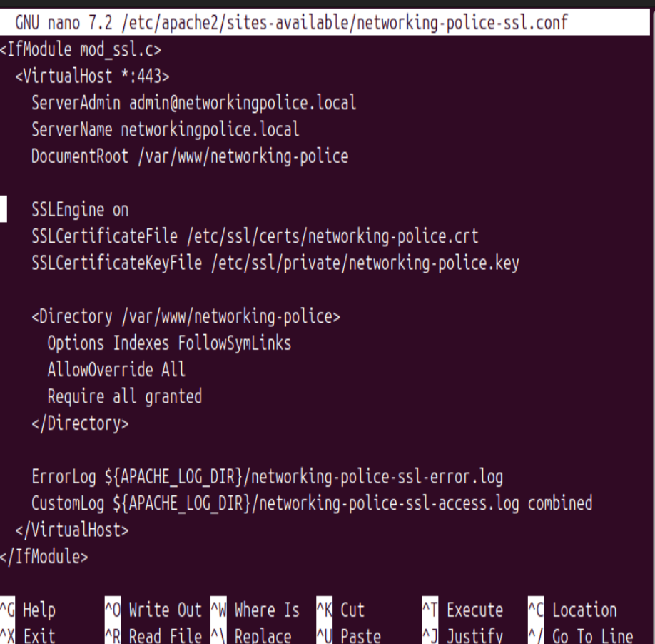
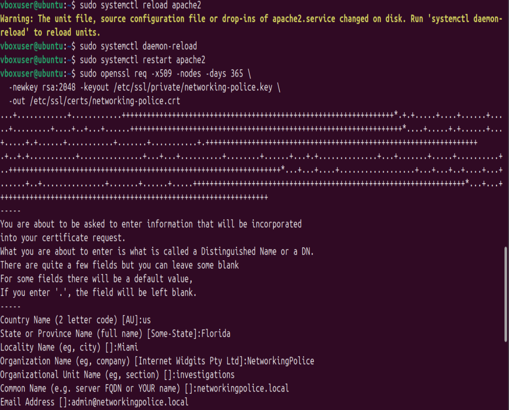
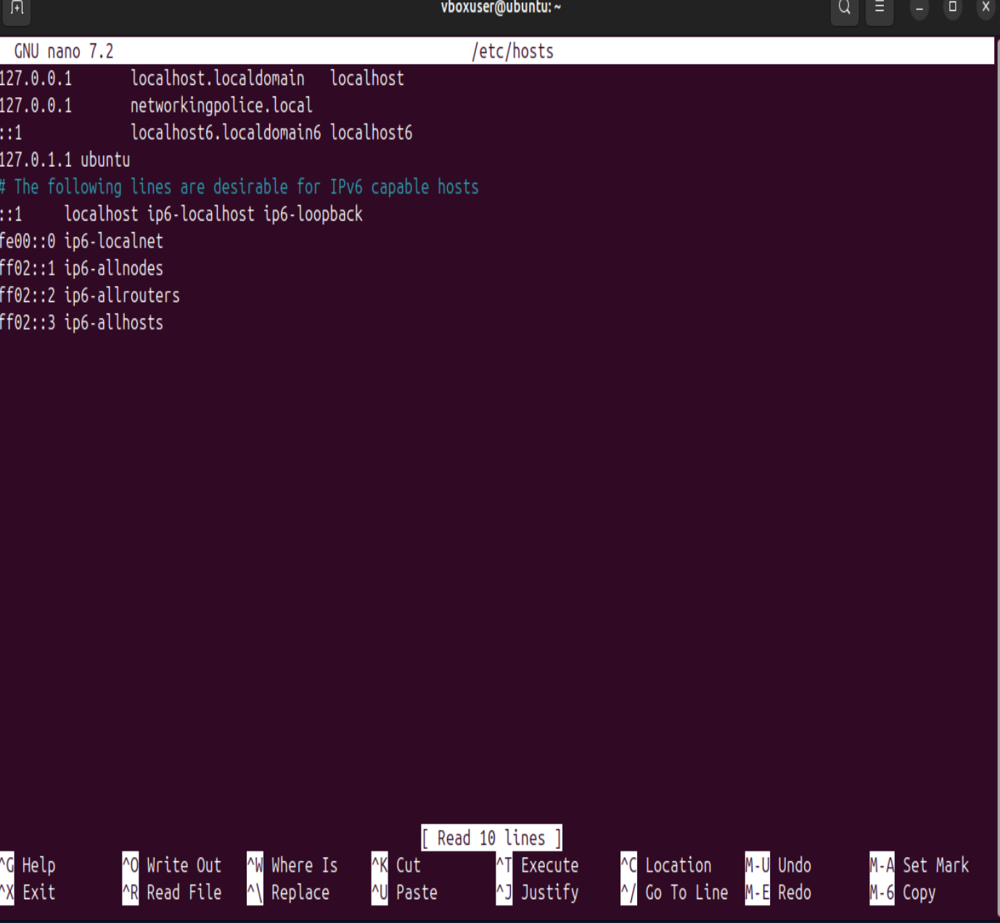
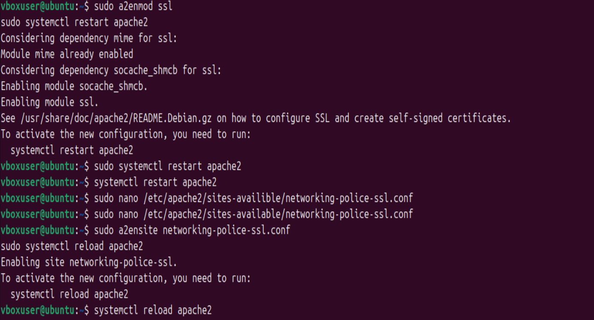

# 👮‍♂️ NetworkPolice | Raul's Journey from law enforcement to network enforcement—building secure systems one subnet at a time.

Welcome to my digital beat. I'm Raul, a current police officer turned networking enthusiast. I am currently looking under the hood of networking to build the skills and projects that power secure systems. Some systems are great but sometimes systems need a little more boost and fine tunning. I specialize in hands-on network configurations, firewall management "Yes! I get to be a firefighter...well a networking one", and system hosting—rooted in a mindset of discipline, reliability, and security. To some it all up im here to learn and pave my way into networking and security. Maybe one day ill will get there and live in the cloud but I know I have manytrack 

## 🛠️ Core Skills & Tools
- Networking: DNS, DHCP, Subnetting, Firewall Rules
- Systems: Linux (Ubuntu), Apache, Virtual Machines
- Web: HTML, CSS (Retro Web Design Projects)
- Security Awareness: Protocol Adherence, Threat Detection
- Scripting: Python (automation experiments in progress) learning as i go.

## 🚨 Certifications in Progress
- 🎓 Network+ (Studying)
- 🔐 Security+ (Next on the list!)

## 📁 Featured Projects
### 🔗 [Virtual Machine Network Lab](https://github.com/NetworkPolice/vm-networking-lab)
- Built and configured VM networks with custom DNS & firewall rules.

### 🌐 [Retro MySpace-Inspired Website](https://github.com/NetworkPolice/retro-web-hosting)
- Hosted on Ubuntu with Apache; includes autoplay music and nostalgic design.

### 🔒 [Firewall Division](https://networkpolice.github.io/NetworkPolice/firewall.html)
- Real-world rule sets with iptables, including zone-based segmentation.

###    [DNS Division](https://networkpolice.github.io/NetworkPolice/dns.html)
- Prepare zone files, investigate lookup anomalies, and enforce DNS protocols.

## 🔐 Networking Police HTTPS Setup

This local deployment demonstrates SSL implementation using Apache and a self-signed certificate. The site runs securely at `https://networkingpolice.local` on an Ubuntu VM.

### 📸 Screenshots

#### 🛡️ Secure Homepage

#### ⚠️ SSL Browser Warning

#### ⚙️ Apache SSL Config

#### 🔏 Certificate Creation

#### 🗂️ Hosts File Mapping

#### 🧰 Apache Enable Commands

> ⚠️ This site runs locally using a self-signed certificate. It is not accessible externally, but demonstrates secure site setup for portfolio purposes.

## 🎯 Mission
To build a portfolio that reflects my commitment to secure, stable networking environments—and to launch my tech career with a strong foundation in cybersecurity.

## 📫 Contact & Connect
- GitHub: [NetworkPolice](https://github.com/NetworkPolice)
- LinkedIn: *(Are we still using this?)*

---
